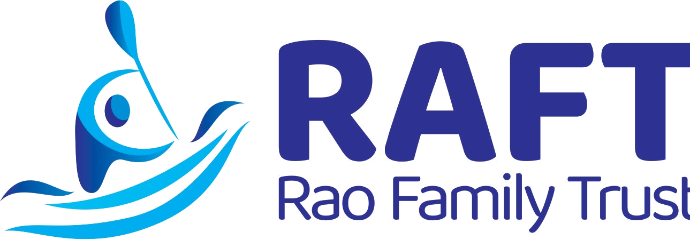
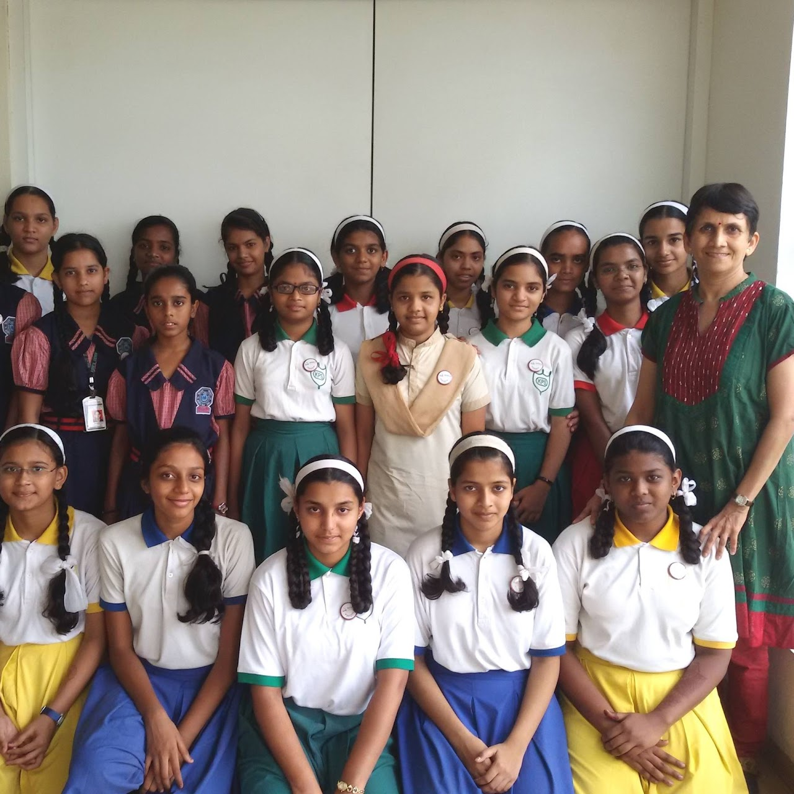
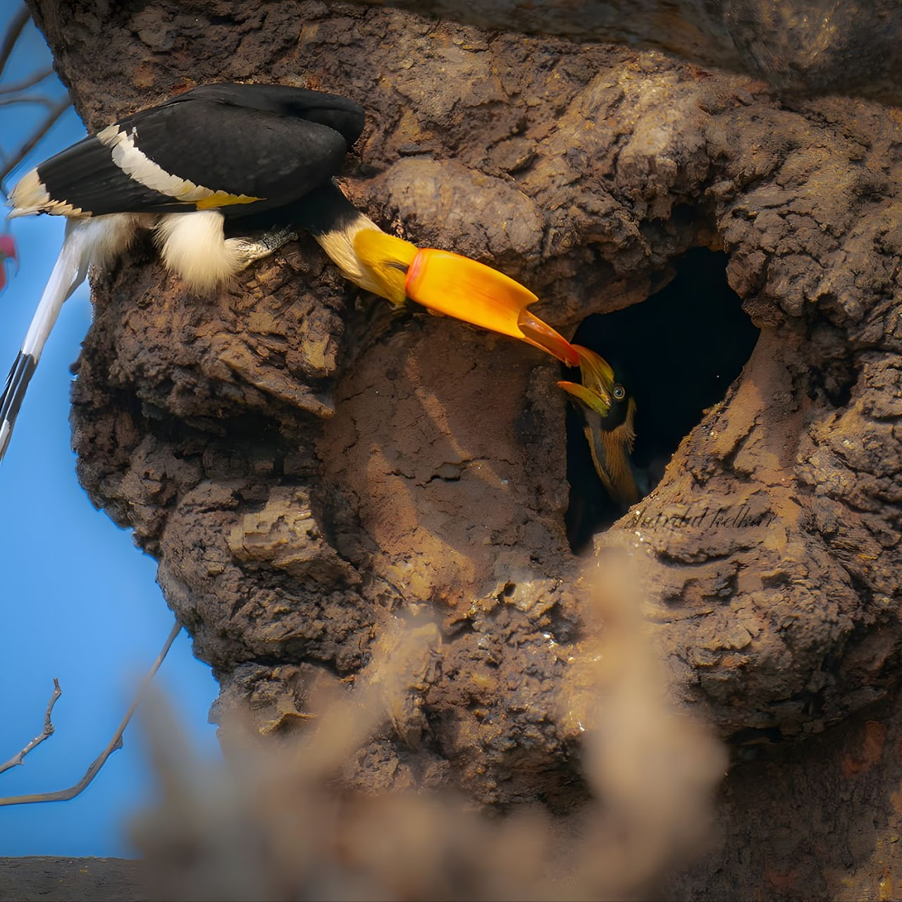
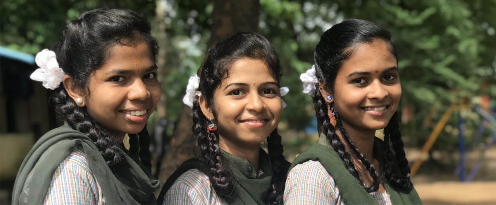
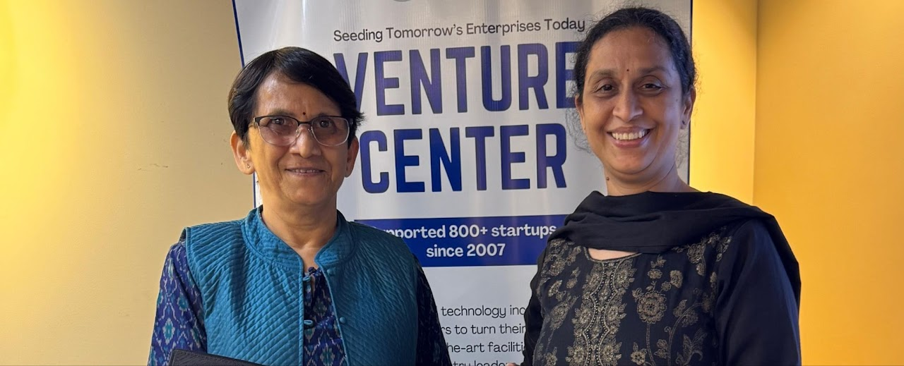

<!-- _class: title-slide -->

# RAFT
### Rao Family Trust

**Together Towards Lasting Change**

www.raft.org.in | contact@raft.org.in | linkedin.com/company/rao-family-trust

---

## About Us

The Rao Family Trust (RAFT) offers grants to nonprofits with a rigorous, evidence-based approach focused on measurable, sustainable results. 

As a private trust, RAFT channels its resources in a structured, transparent, and purpose-driven manner to ensure that its philanthropic vision continues to inspire meaningful change for generations.

*We are based in Pune, Maharashtra.*

  

    <h3>Vision</h3>
    
A compassionate, equitable, and sustainable world where every individual and ecosystem has the opportunity to thrive.

  

  

    <h3>Mission</h3>
    
Creating enduring social and ecological impact through strategic, transparent, and intergenerational philanthropy.

  

---

## OUR APPROACH

Our grantmaking is grounded in trust, simplicity and curiosity. 

Through our grants, we support organisations to respond to community needs and scale proven models and frameworks. We also provide multi-year funding that helps organisations build capacity, strengthen sustainability and create lasting change.

---

## Meet Our Team

  

    <h3>Dr. Priti Rao</h3>
    
Managing Trustee

    
A corporate leader, entrepreneur and philanthropist with a strong background in IT leadership and social enterprise. After senior roles at Infosys and L&T, she founded Pumpkin Patch Daycare to support working mothers, and leads Aatmaja Foundation — focused on empowering girls from disadvantaged backgrounds through STEM education.

  

  
  

    <h3>Jay Rao</h3>
    
Trustee

    
Founder of Milestones, with expertise in early childhood development, care and education. Milestones has been associated with over 175 schools and daycare centres, providing guidance, solutions, and world-class equipment, teaching aids and books.

  

  

    <h3>Dr. Pooja Rao</h3>
    
Trustee

    
A physician-scientist, entrepreneur and research leader working at the intersection of healthcare, AI and global innovation. Currently a Research Scientist at Google, Amsterdam, leading global AI research, clinical studies and regulatory approvals. She holds a medical degree and a PhD in Neuroscience from the Max Planck Research School, Germany.

  

  
  

    <h3>Priyadarshini Gurav</h3>
    
Trustee

    
A dedicated social work professional with over a decade of experience in Medical and Psychiatric Social Work. She is deeply committed to empowering women through development focused workshops and initiatives.

  

---

## Our Pillars of Giving

  

    <h3>Education</h3>
    <ul>
      <li>Enable professional education and quality learning for girls ensuring economic independence</li>
      <li>Transform girls into future leaders and changemakers</li>
      <li>Improve educational opportunities in remote communities</li>
    </ul>
  

  

    <h3>Biodiversity & Conservation</h3>
    <ul>
      <li>Protect biodiversity, wildlife habitats, and critical ecosystems</li>
      <li>Support community-led conservation through science-based solutions</li>
      <li>Inspire environmental stewardship for a sustainable future.</li>
    </ul>
  

  

    <h3>Livelihoods</h3>
    <ul>
      <li>Drive women’s economic empowerment</li>
      <li>Build market-relevant skills leading to meaningful careers and higher incomes and entrepreneurship</li>
      <li>Strengthen women’s confidence, leadership in society</li>
    </ul>
  

  

    <h3>Tech for Good</h3>
    <ul>
      <li>Apply technology and innovation to address pressing social challenges</li>
      <li>Accelerate the diffusion of technology to underserved communities</li>
      <li>Support scalable, sustainable solutions that expand access</li>
    </ul>
  

  

    <h3>Disability Inclusion</h3>
    <ul>
      <li>Expand access to education, employment, and services.</li>
      <li>Enable skills, livelihoods, and independence.</li>
      <li>Promote dignity, inclusion, and participation</li>
    </ul>
  

  Geographic Focus: Primarily - Maharashtra, India

---

<!-- _class: divider-slide -->

Our Current Projects in

# EDUCATION

---

## ENABLING OUR DAUGHTERS : AATMAJA FOUNDATION

  
Pune | Girls from socioeconomically disadvantaged backgrounds | Grant: 2015 – Ongoing

  
aatmaja.org

Through 4 strategic programs, Aatmaja Foundation builds confidence, life skills and professional capabilities to create empowered and self-reliant women.

  
<h3 style="font-size:16px;">Udaan Program</h3>
Long-term educational support guiding girls through scholarships, mentorship & skill-building to become independent professionals.

  
<h3 style="font-size:16px;">Aasha Program</h3>
Equips girls with job-ready vocational skills across healthcare, technology, hospitality & wellness for faster employment.

  
<h3 style="font-size:16px;">Girls in STEM</h3>
Builds girls' confidence and interest in STEM through hands-on workshops, expert talks, mentoring & industry exposure.

  
<h3 style="font-size:16px;">Multi Skill Foundation Course (MSFC)</h3>
Practical vocational training across engineering, electrical, plumbing & agriculture — building technical skills & career readiness.

Impact Snapshot

  
<h4>500+</h4>
Girls supported

  
<h4>100+</h4>
From rural Maharashtra

  
<h4>120+</h4>
Employed / entrepreneurs

  
<h4>98%</h4>
STEM improvement

  
<h4>200+</h4>
Trained under MSFC

---

## CREATING FIRST GENERATION LEARNERS :: AYANG TRUST

  
Majuli, Assam | Children from Mising Tribe, Assam | Grant: 2025 – 2029

  
thehummingbirdschool.in

The Hummingbird School, under Ayang Trust, operates at the intersection of education and resilience in the flood-affected communities of Majuli, which continue to grapple with poor connectivity, fragile infrastructure, and deep-rooted socio-economic challenges. The Hummingbird School has been committed to ensuring access to quality education for these children. The pedagogy and the curriculum of the school deviate from the conventional learning methods, emphasizing experiential learning, inquiry-driven and context-relevant learning. This has allowed the children to connect their education with their lived realities while developing their curiosity, creativity and critical thinking.

Impact

  
37 students receive continued residential and educational support

---

<!-- _class: divider-slide -->

Our Current Projects in

# BIODIVERSITY &  CONSERVATION

---

## GUARDIANS OF THE GIANTS :: SAHYADRI SANKALP SOCIETY

  
Ratnagiri | Malabar Pied Hornbill, Great Hornbill, Malabar Grey Hornbill | Grant: 2025 – 2028

  
sahyadrisankalpsociety.org

The Western Ghats is home to three iconic Hornbill species. These birds are critical seed dispersers, shaping forest regeneration and structure. However, their survival is threatened by loss of nesting and fruiting trees, forest degradation and fragmentation and lack of public awareness. The project focuses on a landscape-level conservation approach emphasizing nest protection, habitat restoration and community involvement.

Impact

  
<h4>102</h4>
Nest sites identified

  
<h4>61</h4>
Active nests documented

  
<h4>100+</h4>
Monitored by community

  
<h4>5500+</h4>
Seeds collected

  
<h4>4000+</h4>
Seeds sown in a nursery

---

## CATAPULTS TO CAMERAS :: HUMAN & ENVIRONMENT ALLIANCE LEAGUE

  
Jhargram, West Bengal | Boys from Hunting Communities & Wildlife | 2026 – 2027

  
healearth.in

In Southern West Bengal, over 40 mass hunting festivals are documented annually across seven districts — drawing up to 20,000 armed participants and killing thousands of wild animals in a single day. These are not subsistence hunts. They are organised bloodsport.

In these villages, boys are handed catapults as young as age three. By adolescence, participation in mass hunts is a rite of masculinity and belonging. The solution starts with children. When boys in these communities are given cameras, mentorship, and recognition, their relationship with nature shifts fundamentally.

Catapults to Cameras — a critically acclaimed documentary by wildlife filmmaker Ashwika Kapur and HEAL's field team — followed five adolescent boys who voluntarily gave up their catapults and became wildlife enthusiasts and conservation ambassadors. The film earned international recognition, turning a grassroots experiment into a global conversation. This project scales that model.

Expected Impact

  
<h3 style="font-size:14px;">Mobile Field Library</h3>
To travel across 12 villages with wildlife films, binoculars & more

  
<h3 style="font-size:14px;">12 children</h3>
To receive training in photography and wildlife observation

  
<h3 style="font-size:14px;">Kids’ Nature Clubs</h3>
Village-level conservation clubs to be formed

  
<h3 style="font-size:14px;">Nature Learning</h3>
Workshops and screening to be conducted in hunting villages

  
<h3 style="font-size:14px;">District-Level Exhibition</h3>
To be held for public recognition from local leaders & officials for the 12 children

---

<!-- _class: divider-slide -->

Our Current Projects in

# LIVELIHOODS

---

## CLIMATE SMART AGRICULTURE :: MANNDESHI

  
Satara, Sangli, Solapur, Pune district, Maharashtra | Women farmers | 2026 – 2027

  
manndeshifoundation.org

Farmers have largely relied on traditional practices, even though agriculture is a highly technical and scientific field. By focusing on soil, we intervene at the very beginning of the crop cycle, where the foundation of productivity is set.

The project aims to strengthen the capacity and resilience of 1,500 farmers by improving soil health knowledge, introducing climate-smart agricultural practices, and increasing access to emerging agricultural technologies. Through soil testing services, advanced courses on horticulture farming and knowledge sessions on agri-tech, artificial intelligence in agriculture, climate literacy, and scientific farming methods, the project will equip farmers with the tools and information needed to make data-driven decisions.

Expected Impact

  
<h4>1500</h4>
women farmers Total beneficiary count

  
<h4>1200</h4>
To be trained in scientific agricultural, climate literacy and AI

  
<h4>250</h4>
Will be provided with soil testing

  
<h4>50</h4>
To be trained in advanced horticulture farming

  
<h4>6</h4>
Exposure Visits To learn best practices and meet other farmers

---

## ROOTS SHASHWAT VIKAS KENDRA :: GOKHALE INSTITUTE OF POLITICS & ECONOMICS

  
Mahad Taluka in Raigad district, Maharashtra | Tribal & marginalized communities | 2026 – 2027

  
gipe.ac.in

Mahad Taluka in Raigad district faces four compounding challenges:
1. Socio-Economic Vulnerability: Small farmers and landless labourers remain largely excluded from the formal economy
2. Ecological Degradation: Biodiversity loss and erosion of traditional ecological knowledge
3. Climate & Resource Stress: Growing water insecurity and soil degradation, worsened by poor waste management and inefficient agricultural practices
4. Institutional Gaps: Local Gram Panchayats lack the technical capacity to implement key mandates

The Shashwat Vikas Kendra will serve as a localised hub addressing these challenges across three pillars: Natural Resource Management, Livelihood Security and Village-level Governance

Expected Impact

  
<h3 style="font-size:14px;">Livelihoods</h3>
Reduced migration; alternate livelihoods

  
<h3 style="font-size:14px;">Environment</h3>
Legal protection of bio-resources and traditional knowledge

  
<h3 style="font-size:14px;">Waste/Water</h3>
Improved public health and groundwater levels.

  
<h3 style="font-size:14px;">Governance</h3>
Decentralized, data-driven local governance.

  
<h3 style="font-size:14px;">Women Empowerment</h3>
Shift from passive beneficiaries to active participation.

---

<!-- _class: divider-slide -->

Our Current Projects in

# TECHNOLOGY

---

## PREVENTION OF AVOIDABLE BLINDNESS :: SHANTILAL SHANGHVI EYE INSTITUTE

  
M/E Ward, Mumbai, Maharashtra | Residents | 2026 – 2027

  
ssei.care/

Maharashtra's rate of blindness and visual impairment exceeds the national average. In Mumbai's M/E ward, one of the city's most densely populated slums, nearly 2% of residents are blind and 13% live with visual impairment, yet 66% of that blindness and 84% of that impairment is treatable.

The program takes a pocket-based approach, bringing awareness, community engagement and screening directly into neighborhoods, with at least six months of follow-up to build lasting eye-health habits. ’Sakhis’, women from the community are trained on two cutting-edge portable tools: Remidio's split lamp for a thorough anterior eye exam, and a handheld fundus camera that delivers high-quality retinal screening in under a minute.

The goal is to screen and treat preventable causes of blindness — cataract, uncorrected refractive error, glaucoma, and diabetic retinopathy, while building a sustainable model through links to existing government schemes and strengthening the community's long-term access to and habits around eye care.

Expected Impact

  
<h3 style="font-size:16px;">45,000+</h3>
Residents to receive free eye screening

  
<h3 style="font-size:16px;">25%</h3>
Of screenings expected to require evaluation for vision disorders

  
<h3 style="font-size:16px;">250</h3>
Expected to require surgery for cataract and glaucoma

  
<h3 style="font-size:16px;">1000</h3>
Individuals are expected to require spectacles for refractive correction

  
<h3 style="font-size:14px;">Diabetic Retinopathy</h3>
Screening will flag need for advanced care before vision loss becomes permanent

---

<!-- _class: title-slide -->

"Philanthropy can catalyze systemic change, fostering equity, equality, and resilience across communities, ecosystems, and our shared future.   I encourage you to use your voice, influence, and resources to help shape a more equitable and resilient future."

---

<!-- _class: title-slide -->

# Get in Touch

  
<strong>contact@raft.org.in</strong>

  
<strong>www.raft.org.in</strong>

  
<strong>linkedin.com/company/rao-family-trust</strong>

